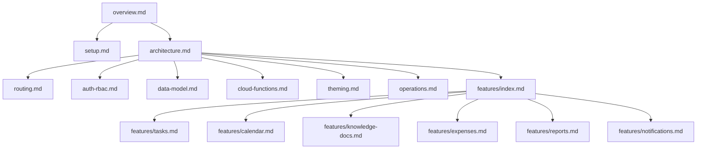

# COSMOS Documentation

This folder is the source of the COSMOS technical documentation. The docs are Markdown with Mermaid diagrams.

## How To Read
Start here:
- overview.md
- setup.md
- architecture.md

Then go deeper:
- routing.md
- auth-rbac.md
- data-model.md
- cloud-functions.md
- theming.md
- operations.md
- features/index.md
- USER_WORKFLOW_GUIDE.md (role walkthroughs)

## Diagram Conventions
- Mermaid graphs describe flow and relationships.
- Direction: top-down unless noted.

## Docs Map

