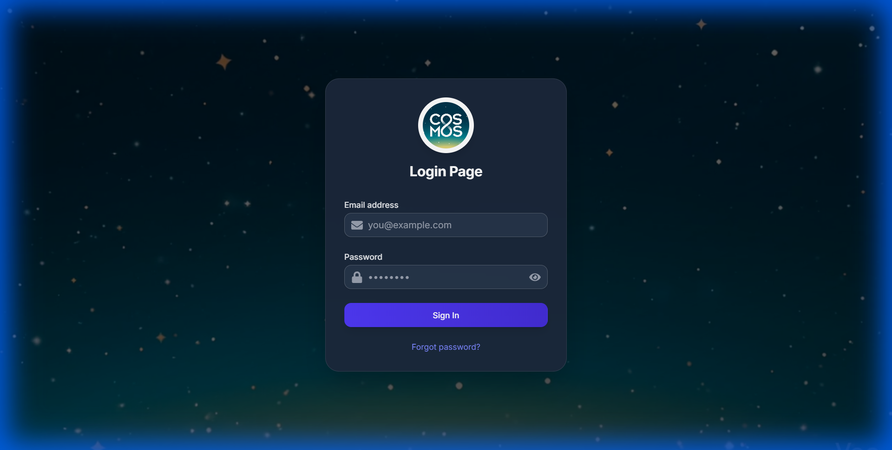
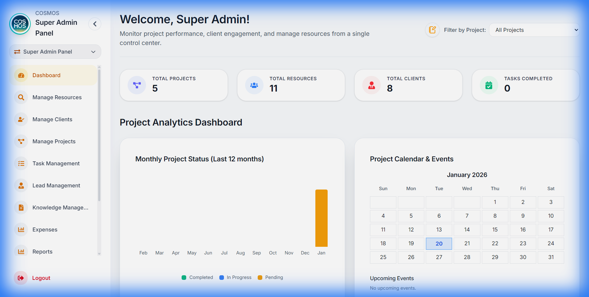
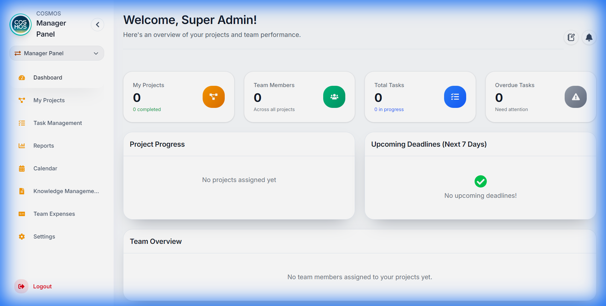

# PM Admin Panel - Complete User Workflow Guide

A comprehensive guide for **all user roles** to understand and navigate the PM Admin Panel effectively.

---

## Table of Contents

1. [Getting Started](#getting-started)
   - [Login](#login)
   - [Password Management](#password-management)
   - [Navigation Overview](#navigation-overview)
   - [Panel Switcher](#panel-switcher)
2. [Super Admin Panel](#super-admin-panel)
   - [Dashboard Overview](#super-admin-dashboard-overview)
   - [Manage Resources](#manage-resources)
   - [Manage Clients](#manage-clients)
   - [Manage Projects](#manage-projects)
   - [Task Management](#super-admin-task-management)
   - [Lead Management](#lead-management)
   - [Knowledge Management](#super-admin-knowledge-management)
   - [Expenses](#super-admin-expenses)
   - [Reports](#super-admin-reports)
   - [Calendar](#super-admin-calendar)
3. [Admin Panel](#admin-panel)
   - [Dashboard Overview](#admin-dashboard-overview)
   - [Key Features](#admin-key-features)
4. [Manager Panel](#manager-panel)
   - [Dashboard Overview](#manager-dashboard-overview)
   - [Quick Actions (Notes & Reminders)](#quick-actions-notes--reminders)
   - [Notifications](#notifications)
   - [Expense Management](#manager-expense-management)
   - [Knowledge Management](#knowledge-management)
5. [Employee Panel](#employee-panel)
   - [Dashboard Overview](#employee-dashboard-overview)
   - [Task Management](#task-management)
   - [My Projects](#my-projects)
   - [Calendar](#calendar)
   - [Expense Submission](#employee-expense-submission)
   - [Reports](#reports)
6. [Client Panel](#client-panel)
   - [Dashboard Overview](#client-dashboard-overview)
   - [My Projects](#client-projects)
   - [Task Tracking](#client-task-tracking)
   - [Calendar](#client-calendar)
   - [Reports](#client-reports)

---

## Getting Started

### Login

To access the PM Admin Panel, navigate to the application URL and you will be presented with the login page.

**Steps to Login:**
1. Enter your **Email Address** in the email field
2. Enter your **Password** in the password field
3. Click the **Sign In** button
4. If you've forgotten your password, click **"Forgot password?"** link

> [!NOTE]
> First-time users may be required to change their password upon initial login if configured by the administrator.

---

### Password Management

#### Forgot Password
1. Click **"Forgot password?"** on the login page
2. Enter your registered email address
3. Click **Submit**
4. Check your email for a password reset link
5. Click the link and set a new password

#### Reset Password
1. Open the password reset link from your email
2. Enter your new password
3. Confirm the new password
4. Click **Reset Password**

> [!IMPORTANT]
> Password requirements:
> - Minimum 8 characters
> - Use a mix of letters, numbers, and special characters

---

### Navigation Overview

After logging in, you'll see the main navigation sidebar on the left side of the screen with quick access to all features based on your role.

| Role | Available Navigation |
|------|----------------------|
| **Super Admin** | Dashboard, Manage Resources, Manage Clients, Manage Projects, Task Management, Lead Management, Knowledge Management, Expenses, Reports, Calendar |
| **Admin** | Dashboard, Manage Resources, Manage Clients, Manage Projects, Task Management, Knowledge Management, Expenses, Reports, Calendar |
| **Manager** | Dashboard, My Projects, Task Management, Calendar, Knowledge Management, Team Expenses, Reports, Settings |
| **Employee** | Dashboard, My Tasks, Projects, Calendar, Knowledge, My Expenses, Reports, Settings |
| **Client** | Dashboard, My Projects, Tasks, Calendar, Reports, Documents |

---

### Panel Switcher

If you have access to multiple roles, you can switch between panels using the **Panel Switcher**:

1. Click on the **current panel name** in the sidebar header (e.g., "Super Admin Panel")
2. A dropdown appears showing all available panels
3. Click on the panel you want to switch to
4. The page refreshes with the new panel view

> [!TIP]
> Super Admins can access all panels to view the system from different user perspectives.

---

## Super Admin Panel

### Super Admin Dashboard Overview

The Super Admin Dashboard provides complete visibility into the entire system with project analytics, resource allocation, and task management.

#### Key Statistics Cards

| Stat Card | Description |
|-----------|-------------|
| **Total Projects** | All projects in the system |
| **Total Resources** | Number of employees and contractors |
| **Total Clients** | Number of active clients |
| **Tasks Completed** | Total completed tasks across all projects |

#### Project Analytics Dashboard

- **Monthly Project Status Chart** - Bar chart showing Completed, In Progress, and Pending projects per month
- **Project Calendar & Events** - Monthly calendar with project deadlines and events
- **Upcoming Events** - List of imminent deadlines and milestones

---

### Manage Resources

Add, edit, and manage all users in the system.

**To Add a New Resource:**
1. Navigate to **Manage Resources** from sidebar
2. Click **"+ Add Resource"**
3. Fill in user details:
   - Name, Email, Phone
   - Role (Super Admin, Admin, Manager, Employee)
   - Department
   - Reporting Manager
4. Click **Save**

**Resource Actions:**
- **Edit** - Update user information
- **Delete** - Remove user from system
- **View Profile** - See detailed user information
- **Assign to Projects** - Add user to project teams

#### Add Hierarchy

Define organizational structure:
1. Go to **Manage Resources > Add Hierarchy**
2. Create departments and reporting structures
3. Assign managers to departments

---

### Manage Clients

Manage all client accounts and information.

**Client Management:**
1. Navigate to **Manage Clients**
2. View all clients in a table/grid format

**Client Actions:**
- **Add Client** - Create new client record
- **Edit Client** - Update client information
- **Delete Client** - Remove client (caution: may affect projects)
- **View Projects** - See all projects for a client

**Client Information:**
- Company name
- Contact person
- Email, Phone, Address
- Associated projects
- Client portal access status

---

### Manage Projects

Create and manage all projects in the system.

#### Creating a New Project

1. Navigate to **Manage Projects**
2. Click **"+ New Project"**
3. Fill in project details:

| Field | Description |
|-------|-------------|
| Project Name | The project title |
| Client | Select from client list |
| Start Date | Project commencement date |
| Deadline | Project completion deadline |
| Description | Project scope and details |
| Budget | Project budget (optional) |
| Team Members | Assign resources to project |
| Project Manager | Designate project manager |

4. Click **Create Project**

#### Project Settings

Configure project-specific settings:
- **Status Settings** - Define custom task statuses
- **Team Hierarchy** - Set project-specific reporting structure
- **Access Control** - Manage who can view/edit project

---

### Super Admin Task Management

Full task management across all projects.

**Features:**
- View all tasks across all projects
- Filter by project, status, priority, assignee
- Create tasks and assign to any resource
- Bulk update task statuses
- Set deadlines and priorities

**Task Actions:**
- Create, Edit, Delete tasks
- Assign/reassign to resources
- Set priority (High, Medium, Low)
- Add subtasks
- View task history and activity

---

### Lead Management

Manage sales leads and potential clients.

**Lead Stages:**
1. **New** - Fresh lead incoming
2. **Contacted** - Initial contact made
3. **Qualified** - Lead verified as potential client
4. **Proposal** - Proposal sent
5. **Won/Lost** - Final outcome

**Lead Actions:**
- Add new leads
- Update lead status
- Add notes and follow-ups
- Convert lead to client
- View lead analytics

---

### Super Admin Knowledge Management

Central knowledge base for the organization.

**Features:**
- Create knowledge categories
- Add documents and articles
- Set access permissions
- Search knowledge base
- Link knowledge to projects

---

### Super Admin Expenses

Review and manage all expense claims across the organization.

**Capabilities:**
- View all submitted expenses
- Approve/reject expenses
- Generate expense reports
- Export expense data
- Set expense policies and limits

---

### Super Admin Reports

Generate comprehensive system reports.

**Report Types:**
- **Project Reports** - Project status, progress, timelines
- **Resource Reports** - Utilization, workload distribution
- **Financial Reports** - Budget vs actual, expenses
- **Task Reports** - Completion rates, overdue tasks
- **Client Reports** - Client-wise project summaries

---

### Super Admin Calendar

Organization-wide calendar view.

- View all project deadlines
- See task due dates across projects
- Track team events and meetings
- Add organization-wide events

---

## Admin Panel

### Admin Dashboard Overview

The Admin Dashboard is similar to Super Admin but with slightly limited scope, focusing on day-to-day administrative operations.

#### Key Features

| Feature | Description |
|---------|-------------|
| **Dashboard** | Similar stats to Super Admin (Projects, Resources, Clients, Tasks) |
| **Manage Resources** | Add/edit users (may have limitations on Super Admin accounts) |
| **Manage Clients** | Full client management |
| **Manage Projects** | Create and manage projects |
| **Task Management** | Manage tasks across projects |
| **Knowledge Management** | Manage knowledge base content |
| **Expenses** | Approve team expenses |
| **Reports** | Generate administrative reports |
| **Calendar** | View project calendars |

### Admin Key Features

**Differences from Super Admin:**
- Cannot modify Super Admin accounts
- May have restricted access to system settings
- Cannot change organization-wide configurations
- Limited access to sensitive financial data

**Shared Capabilities:**
- Full project management
- Client management
- Resource assignment
- Task oversight
- Expense approval

---

## Manager Panel

### Manager Dashboard Overview

The Manager Dashboard provides a comprehensive view of your managed projects and team performance.

#### Key Statistics Cards
The dashboard displays four primary stat cards at the top:

| Stat Card | Description |
|-----------|-------------|
| **Total Projects** | Number of projects you manage |
| **Completed Projects** | Projects with all tasks completed |
| **Total Tasks** | All tasks across your projects |
| **Team Size** | Number of team members on your projects |

#### Additional Metrics
- **Completed Tasks** - Total tasks marked as done
- **In Progress Tasks** - Tasks currently being worked on
- **Overdue Tasks** - Tasks past their due date

---

#### Project Progress Section

View progress for all your managed projects:

1. Each project card shows:
   - Project name
   - Progress percentage bar
   - Tasks completed vs total tasks

2. Click on a project to see more details

---

#### Upcoming Deadlines (Next 7 Days)

This section displays tasks due within the next 7 days:
- Task title
- Due date
- Priority level
- Assigned team member

> [!TIP]
> Use this section to prioritize follow-ups with team members on approaching deadlines.

---

#### Team Overview

See all team members working on your projects:
- Team member name
- Profile picture/avatar
- Current role

---

### Quick Actions (Notes & Reminders)

Located in the top-right corner of the dashboard, click the **notebook icon** to access quick actions.

#### Quick Notes

Create and manage personal notes:

**To Create a Note:**
1. Click the **notebook icon** in the header
2. Select **"Quick Notes"**
3. Type your note in the text field
4. Click **Save** or press Enter

**Note Features:**
- **Pin Notes** - Click the pin icon to keep important notes at the top
- **Edit Notes** - Click on a note to modify it
- **Delete Notes** - Click the delete icon to remove a note

---

#### Reminders

Set personal reminders for important tasks:

**To Set a Reminder:**
1. Click the **notebook icon** in the header
2. Select **"Reminders"**
3. Click **"+ Add Reminder"**
4. Fill in:
   - **Title** - Brief reminder description
   - **Date** - When to be reminded
   - **Time** - Specific time for the reminder
   - **Description** (optional) - Additional details
5. Click **Save**

**Reminder Behavior:**
- Reminders appear as toast notifications at the scheduled time
- They also appear in the notification bell
- Click **X** to dismiss a reminder

> [!NOTE]
> Reminders check every 10 seconds for due items, so notifications appear promptly.

---

### Notifications

Click the **bell icon** in the header to view notifications:

**Notification Types:**
| Type | Icon Color | Description |
|------|------------|-------------|
| **Overdue Tasks** | Red | Tasks past their due date |
| **Project Deadlines** | Orange | Projects approaching deadline (within 7 days) |
| **New Tasks** | Blue | Recently created tasks in your projects |
| **Reminders** | Purple | Personal reminders you've set |

**Actions:**
- Click a notification to navigate to the relevant section
- Click **X** to dismiss individual notifications
- Click **"Clear All"** to dismiss all notifications

---

### Manager Expense Management

Approve or reject expense claims from your team members.

#### Viewing Expenses

1. Navigate to **Expenses** from the sidebar
2. You'll see all expense claims from team members on projects you manage

**Expense Information Displayed:**
- Employee name
- Expense category
- Amount
- Status (Pending/Approved/Rejected)
- Submission date
- Attached documents/receipts

#### Approving an Expense

1. Find the expense in the list
2. Review the details and attached documentation
3. Click the **Approve** button (green checkmark)
4. The expense status changes to "Approved"

#### Rejecting an Expense

1. Find the expense in the list
2. Click the **Reject** button (red X)
3. Enter a **rejection reason** in the popup
4. Click **Submit**
5. The employee will see the rejection reason

> [!IMPORTANT]
> Always provide a clear reason when rejecting expenses to help employees understand and correct their submissions.

---

### Knowledge Management

Access and manage project documentation and knowledge base articles.

1. Navigate to **Knowledge Management** from the sidebar
2. Browse available knowledge categories
3. Click on a document to view its contents
4. Search for specific topics using the search bar

---

## Employee Panel

### Employee Dashboard Overview

Your personal dashboard showing task summaries and performance metrics.

#### Statistics Cards

| Card | Description |
|------|-------------|
| **Total Tasks** | All tasks assigned to you |
| **Completed** | Tasks you've finished |
| **In Progress** | Tasks you're currently working on |
| **Overdue** | Tasks past their due date |

---

#### Today's Tasks

View all tasks due today:
- Task title
- Priority level (High/Medium/Low)
- Project name
- Quick complete button

**Quick Complete:**
1. Click the **checkmark** button on a task
2. Optionally add a completion comment
3. Click **Submit**

---

#### Performance Metrics

- **Completion Rate** - Percentage of tasks completed
- **Active Projects** - Number of projects you're involved in
- **High Priority Tasks** - Count of urgent tasks pending

---

#### Recent Activity

Shows tasks completed in the last 7 days:
- Task name
- Completion date
- Project name

---

### Task Management

Navigate to **Tasks** from the sidebar for full task management capabilities.

#### Task Views

Switch between different task views using the tabs:
- **All Tasks** - Every task assigned to you
- **To-Do** - Tasks not yet started
- **In Progress** - Tasks you're working on
- **Overdue** - Tasks past due date
- **Self Tasks** - Tasks you created for yourself

---

#### Viewing Task Details

Click on any task to open the Task Detail Modal:
- Full task description
- Due date and time
- Priority level
- Project information
- Subtasks (if any)
- Activity history

---

#### Updating Task Status

**Method 1: Quick Status Change**
1. Click the status dropdown on a task card
2. Select the new status

**Method 2: From Task Modal**
1. Open the task detail modal
2. Click the status field
3. Select the new status

**Available Statuses:**
- **To-Do** - Not started
- **In Progress** - Currently working
- **Done** - Completed

---

#### Marking Tasks Complete

1. Change task status to **"Done"** OR click the complete button
2. A completion modal appears
3. (Optional) Enter a **completion comment** describing what was done
4. Click **Submit**

> [!TIP]
> Adding completion comments helps managers understand what was accomplished and aids in reporting.

---

#### Self Tasks

Create personal tasks for your own tracking:

**To Create a Self Task:**
1. Go to the **"Self Tasks"** tab
2. Click **"+ Add Task"**
3. Fill in:
   - Task title
   - Due date
   - Priority
   - Description
4. Click **Create**

**Managing Self Tasks:**
- Edit by clicking the edit icon
- Delete by clicking the delete icon
- Select multiple for bulk actions

---

#### Task Reminders

Set personal reminders for specific tasks:

1. Click the **bell icon** on a task card
2. Set the reminder date and time
3. Add an optional note
4. Click **Save**

The reminder will notify you at the scheduled time.

---

### My Projects

View all projects you're assigned to.

1. Navigate to **Projects** from the sidebar
2. See project cards with:
   - Project name
   - Client name
   - Your role in the project
   - Project deadline
   - Progress percentage

3. Click a project card to see:
   - Full project details
   - All project tasks
   - Team members
   - Project timeline

---

### Calendar

View all your tasks and events on a calendar.

1. Navigate to **Calendar** from the sidebar
2. View modes:
   - **Month View** - See entire month overview
   - **Week View** - Detailed weekly schedule
   - **Day View** - Hour-by-hour view

3. Calendar shows:
   - Task due dates
   - Meetings
   - Events
   - Deadlines

**Interactions:**
- Click a date to see all items for that day
- Click an item to open its details
- Navigate months using the arrow buttons

---

### Employee Expense Submission

Submit expense claims for reimbursement.

#### Submitting an Expense

1. Navigate to **Expenses** from the sidebar
2. Click **"+ New Expense"** button
3. Fill in the expense form:

| Field | Description |
|-------|-------------|
| **Category** | Type of expense (Travel, Meals, Equipment, etc.) |
| **Amount** | Expense amount in your currency |
| **Date** | Date the expense occurred |
| **Description** | Details about the expense |
| **Project** | Which project this expense is for |
| **Receipt** | Upload photo/document of receipt |

4. Click **Submit for Approval** OR **Save as Draft**

---

#### Expense Statuses

| Status | Meaning |
|--------|---------|
| **Draft** | Saved but not submitted |
| **Pending** | Submitted, awaiting manager approval |
| **Approved** | Manager approved the expense |
| **Rejected** | Manager rejected (check rejection reason) |

---

#### Viewing Your Expenses

- See all your submitted expenses in a table
- Filter by status (All, Pending, Approved, Rejected)
- Click an expense to view full details
- Edit or delete draft/rejected expenses

> [!CAUTION]
> Once an expense is approved, it cannot be edited or deleted.

---

### Reports

Generate and view your performance reports.

1. Navigate to **Reports** from the sidebar
2. Click **"Generate Report"** to create a new report

**Report Contents:**
- Task summary (completed, pending, overdue)
- Performance metrics (completion rate)
- Recent activity
- Today's focus tasks

**Actions:**
- **Download** - Save report as text file
- **Edit** - Modify report content before saving

---

## Client Panel

### Client Dashboard Overview

The Client Dashboard provides visibility into your projects and their progress.

#### Key Statistics Cards

| Stat Card | Description |
|-----------|-------------|
| **My Projects** | Number of projects associated with your account |
| **Total Tasks** | All tasks across your projects |
| **Completed Tasks** | Tasks marked as done |
| **Pending Tasks** | Tasks still in progress |

#### Dashboard Features

- **Project Progress** - Visual progress bars for each project
- **Upcoming Tasks** - Tasks scheduled in the near future
- **Recent Activity** - Latest updates on your projects
- **Quick Notes** - Personal notes linked to projects

---

### Client Projects

View all projects assigned to your account.

1. Navigate to **Projects** from the sidebar
2. See project cards showing:
   - Project name
   - Current status
   - Progress percentage
   - Start and end dates
   - Project team members

**Project Details:**
Click a project to view:
- Full project description
- All project milestones
- Task breakdown
- Team members with contact info
- Project documents

---

### Client Task Tracking

Track tasks across your projects.

**Task Views:**
- View tasks by project
- Filter by status (To-Do, In Progress, Done)
- See priority levels
- Track due dates

**Task Information:**
- Task title and description
- Assigned team member
- Due date
- Current status
- Related project

> [!NOTE]
> Clients can view task progress but cannot modify tasks directly. Contact your project manager for task changes.

---

### Client Calendar

View project schedules and deadlines.

**Calendar Features:**
- Monthly calendar view
- Project milestone markers
- Task due date indicators
- Navigate between months

**Interactions:**
- Click a date to see items due
- Color-coded by project
- View upcoming deadlines at a glance

---

### Client Reports

Access reports on your projects.

**Available Reports:**
- Project status summary
- Task completion metrics
- Timeline and milestone tracking
- Monthly progress reports

**Actions:**
- View reports online
- Download as PDF/Text
- Request custom reports from team

---

## Tips for Success

### For Super Admins & Admins

1. **Monitor system health** - Regularly check resource utilization and project status
2. **Manage users proactively** - Keep user roles and access updated
3. **Review reports weekly** - Stay on top of organizational metrics
4. **Maintain knowledge base** - Keep documentation current

### For Managers

1. **Check notifications daily** - Stay on top of overdue tasks and approaching deadlines
2. **Review expenses promptly** - Keep your team's reimbursements flowing
3. **Use reminders** - Set reminders for important check-ins with team members
4. **Monitor project progress** - Use the dashboard to identify blocked projects

### For Employees

1. **Update task status regularly** - Helps managers track progress
2. **Add completion comments** - Provide context for your work
3. **Check calendar daily** - Never miss deadlines or meetings
4. **Submit expenses with receipts** - Speeds up approval process
5. **Use self-tasks** - Track personal to-dos alongside assigned work

### For Clients

1. **Check project progress regularly** - Stay informed on your projects
2. **Use the calendar** - Track upcoming milestones
3. **Review reports** - Understand project metrics
4. **Contact project manager** - For any questions or changes needed

---

## Keyboard Shortcuts

| Shortcut | Action |
|----------|--------|
| `Escape` | Close modals |
| `Enter` | Submit forms |

---

## Troubleshooting

### Common Issues

**Can't Login:**
- Verify email is correct
- Check Caps Lock for password
- Try "Forgot Password" if needed
- Contact administrator if account is locked

**Tasks Not Loading:**
- Refresh the page
- Check your internet connection
- Clear browser cache
- Try logging out and back in

**Notifications Not Appearing:**
- Check browser notification permissions
- Ensure you're on the dashboard page
- Wait a few seconds (reminders check every 10s)

**Expense Upload Failed:**
- Check file size (max 5MB)
- Use supported formats (PDF, JPG, PNG)
- Try a smaller file or different format

**Panel Switcher Not Showing:**
- You may only have access to one panel
- Contact Super Admin for multi-panel access

---

## Getting Help

If you encounter issues not covered in this guide:

1. Contact your system administrator
2. Check with your project manager
3. Refer to the technical documentation

---

*Last Updated: January 2026*
*Version: 2.0 - All User Roles*

