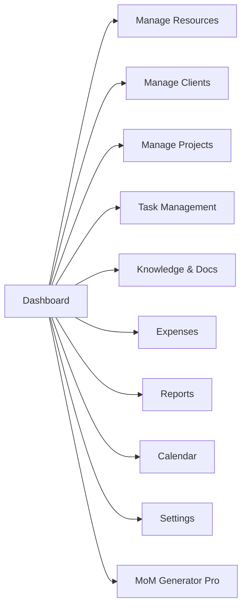
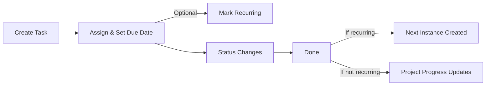
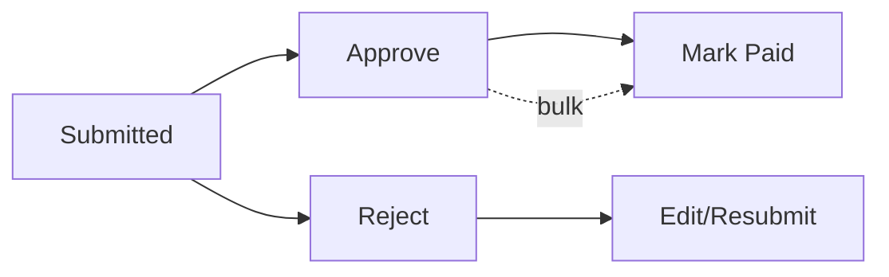

# Admin Portal User Guide

Audience: Admin users managing people, clients, projects, tasks, knowledge, expenses, and meetings.

---

## Access & Layout
- Login → Admin panel (role: admin or higher)
- Sidebar: Dashboard, Resources, Clients, Projects, Tasks, Knowledge/Docs, Expenses, Reports, Calendar, Settings, MoM Pro
- Patterns: search, sort, pagination, dark-mode aware, toast feedback

---

## Dashboard
- Live stats: resources, clients, projects, tasks completed (per-project filter)
- Realtime feeds: projects, tasks, users, clients, events
- Notes: pin/edit/delete; ordered by recency
- Reminders: due reminders surface via toast + inline list
- Quick actions: project filter; menus for reminders/notes

---

## Manage Resources
- Table with search, filters (resource type, employment type, status), sort, pagination
- Actions: view/add/edit/delete; avatar upload; status toggle; role/type fields
- Add: secondary Firebase app creates Auth user + Firestore profile; strong password required
- Edit: profile + optional password update (callable to Auth); avatar replace/remove
- Delete: callable removes Auth user, then Firestore doc

---

## Manage Clients
- Table with search, sort, pagination
- Actions: view/add/edit/delete; logo upload
- Add: secondary Auth creation + Firestore doc; strong password required
- Edit: profile updates, optional password change (callable), logo replace/remove
- Delete: callable removes Auth user, then Firestore doc

---

## Manage Projects
- Views: table or 7-stage Kanban; progress derived from tasks
- Filters: search, sort, quick filters (completed/in-progress/not-started), pagination
- Add: client, manager, assignees, dates, OKRs; required-field validation
- Edit/View/Delete via modals; derived progress shown

---

## Task Management
- Views: list or Kanban; statuses from Settings → Status
- Data: tasks with assignees (users/clients), priorities, projects
- Filters: project, assignee/type, priority, status, overdue, search; toggle archived
- Recurrence: only root tasks spawn next instance on completion; overdue roots also spawn next
- Actions: create/edit/view/delete (single/bulk), complete with comment, change colors, status color mapping, group options

---

## Calendar
- Sources: events, meetingRequests, tasks (due dates); recurring tasks expanded for visible month
- Filters: type, status, project, employee; month navigation
- Actions: create/edit/delete events, accept/reject meeting requests with reason, create tasks
- Task events mirror task status; attendees/client linkage supported

---

## Knowledge & Documents
- Tabs: Knowledge and Documentation
- Knowledge: list/search/sort per project; access control respected; add/edit/delete
- Documentation: project-centric folders; grid/list; search/sort
- Project Detail: per-project docs (by folder) + knowledge, tasks snapshot, access control, folder management, upload/add/delete

---

## Expenses (Admin)
- Shared ExpenseManagementBase: stats cards, filters (status/category/date/search), pagination
- Actions: approve/reject with reason, mark paid, edit, delete, view details, receipts, upload receipt, create expense
- Bulk: approve selected; mark paid selected
- Export: CSV of filtered results

---

## Reports
- Live data: projects, users, clients, tasks
- Filters: project, employee
- Stats: totals, completion rate, status counts, priority breakdown, project/task distribution
- Visuals: pies/lines, Gantt, priority/status badges; download actions present

---

## Settings (Admin)
- Hierarchy: manage role labels (superadmin/admin/manager/member); add/edit/delete; pagination
- Project Level: manage numeric levels + names; validation for uniqueness
- Status: manage task statuses (colors optional); core To-Do/In Progress/Done are reserved and fixed first
- Theme/Profile: standard portal settings routes

---

## MoM Generator Pro
- Build meeting minutes: agenda, discussions, decisions, actions
- Drag/drop agenda items, attendees, versions; save snapshots
- Export: PDF (jsPDF/html2canvas and @react-pdf/renderer), download/print; upload to storage
- Project-aware: pick project, pulls team lists

---

## Tips
- Strong passwords enforced for users/clients
- Keep task statuses aligned with Settings → Status for accurate progress/reports
- Recurring tasks: only roots spawn next on Done; overdue roots also advance schedule
- Calendar shows tasks as all-day at 23:59; recurring expanded only for roots
- Filters reset pagination to page 1 when changed; use search + filters on large tables
