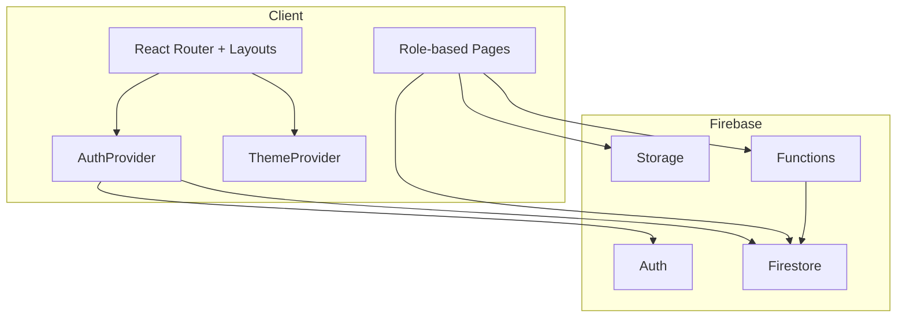

# Architecture

## Stack
- Frontend: React 19 (Vite), React Router v7, Tailwind (via @tailwindcss/vite), React Hot Toast, React Icons, Recharts.
- Firebase: Auth, Firestore, Storage, Functions (callable + scheduled).
- Utilities: ExcelJS (exports), html2canvas + jsPDF (PDF), date-fns.
- Tooling: Vite 7, ESLint 9.

## High-Level Flow

## Providers and Entry
- Router + providers mounted in src/main.jsx (ErrorBoundary -> AuthProvider -> ThemeProvider -> RouterProvider).
- Error boundaries per route via withErrorBoundary.

## Routing and Layouts
- Role-based shells: MainLayout (superadmin), AdminLayout, ManagerLayout, EmployeeLayout, ClientLayout.
- ProtectedRoute checks auth + role hierarchy; session security wrapper.

## Auth and RBAC (see auth-rbac.md)
- Firebase Auth session listener.
- Firestore profile fetch (users -> clients fallback); inactive users are signed out.
- Accessible panels computed from role config; project manager elevation when user manages any project.

## Data
- Firestore collections: users, clients, projects, tasks (recurring metadata), events, meetingRequests, documents/knowledge, expenses, notifications, settings.
- Exports/analytics use onSnapshot where realtime is needed; some pages may fetch once for reports.

## Cloud Functions
- Callable admin ops: updateUserPassword, deleteUserAuth (role-gated).
- Scheduled: checkRecurringTasks daily 02:00 UTC; relies on functions/utils/recurring.js helpers.

## Theming
- ThemeProvider manages light/dark/auto + accent; class toggling on html.
- useThemeStyles centralizes class tokens (see theming.md and THEME_REFACTOR_GUIDE.md).

## Error Handling
- PageErrorBoundary and RouteWithErrorBoundary wrap route elements to isolate failures.

## Build and Deploy
- Vite build outputs to dist/.
- Functions deploy separately from /functions (Node 18+ runtime assumed).
- Hosting target (e.g., Vercel/Firebase Hosting) not documented in code; adjust to your platform.
