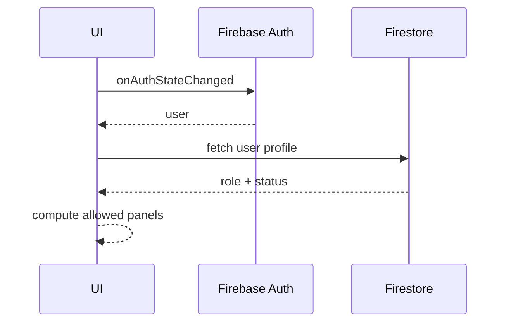
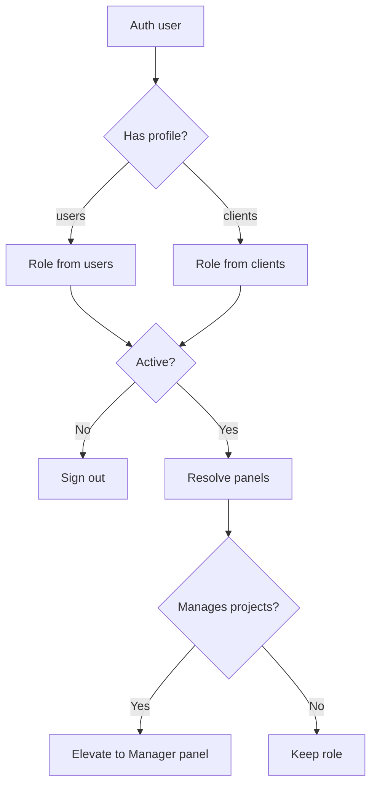

# Auth and RBAC

## Overview
- Firebase Auth is the source of identity.
- Firestore `users` (and `clients` fallback) provide role, status, and profile data.
- ProtectedRoute enforces access by role and session status.

## Auth Flow

## Role Resolution
- Default role from Firestore profile.
- Manager elevation if the user manages any project.
- Inactive users are forced to sign out.

## Access Control
- UI gating via route guards and layout selection.
- Firestore rules should mirror role constraints (see `firestore.rules`).

## Related Files
- src/context/AuthContext.jsx
- src/components/ProtectedRoute.jsx
- src/routes/*
