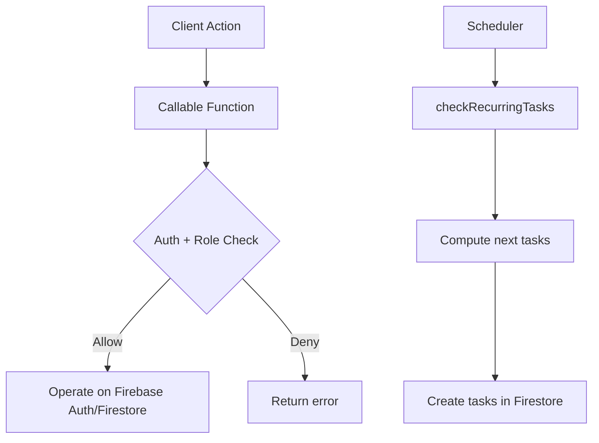

# Cloud Functions

## Overview
Functions are used for admin-only operations and scheduled recurring task processing.

## Callable Functions
- updateUserPassword
- deleteUserAuth

## Scheduled Jobs
- checkRecurringTasks (daily at 02:00 UTC)

## Flow

## Related Files
- functions/index.js
- functions/utils/recurring.js
