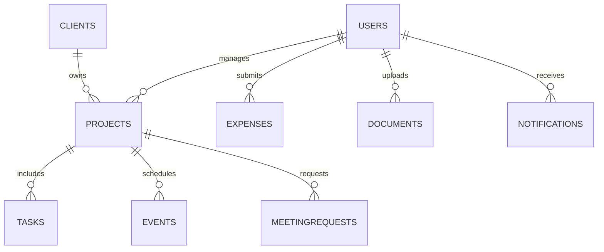

# Data Model

## Core Collections
- users
- clients
- projects
- tasks
- events
- meetingRequests
- documents (knowledge)
- expenses
- notifications
- settings

## Entity Relations

## Tasks
Key fields (expected):
- title, status, dueDate, assigneeId, projectId
- recurring (object: cadence, nextRunAt, lastRunAt)

## Projects
Key fields (expected):
- name, clientId, managerId, status, startDate, endDate

## Users
Key fields (expected):
- uid, role, active, email, displayName

## Documents (Knowledge)
Key fields (expected):
- name, ownerId, projectId (optional), storagePath, type

## Expenses
Key fields (expected):
- amount, status, submittedBy, projectId, approvedBy

## Notifications
Key fields (expected):
- recipientId, type, status, createdAt, payload

## Notes
- Some collections store denormalized data for reporting speed.
- Ensure Firestore rules match access constraints in auth-rbac.md.
