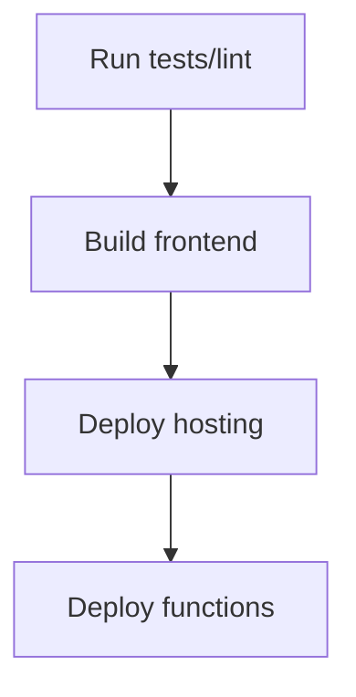

# Operations

## Local Commands
```bash
npm run dev
npm run build
npm run lint
```

## Deploy Flow (Typical)


## Monitoring
- Use Firebase console for Functions logs and Firestore usage.
- Track storage usage and rules denials.

## Release Notes
- Keep SETTINGS_UPDATE_NOTES.md updated for admin-facing changes.
