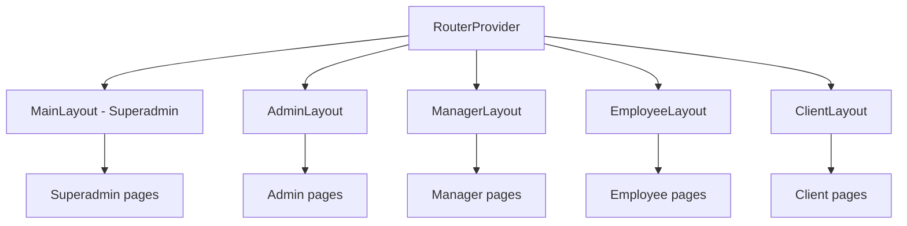
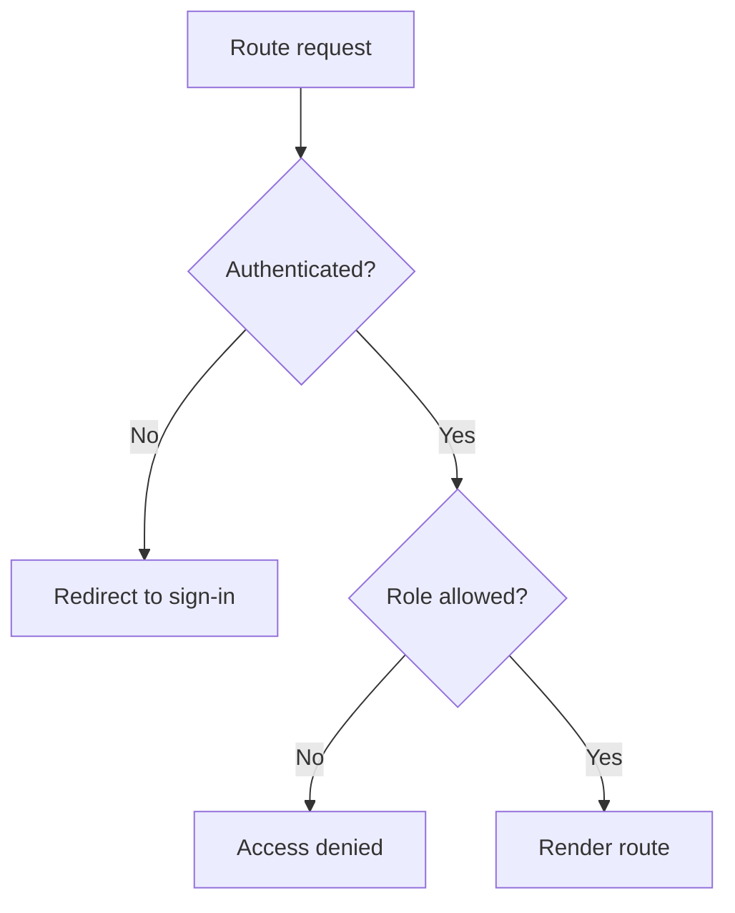

# Routing

## Overview
Routes are organized by role with dedicated layouts. ProtectedRoute ensures session and role access.

## Layout Map

## Guard Flow

## Related Files
- src/main.jsx
- src/components/ProtectedRoute.jsx
- src/routes/*
