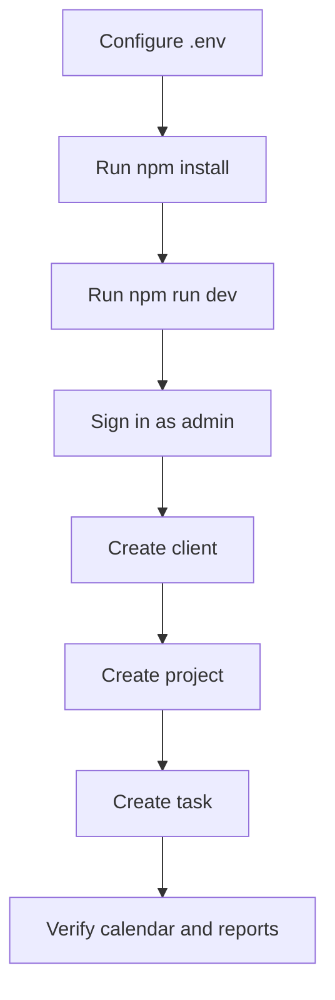

# Setup

## Prerequisites
- Node.js 18+
- Firebase project with Auth, Firestore, Storage, Functions enabled

## Install
```bash
npm install
```

## Environment
Create a `.env` file at repo root. Example keys:
- VITE_FIREBASE_API_KEY
- VITE_FIREBASE_AUTH_DOMAIN
- VITE_FIREBASE_PROJECT_ID
- VITE_FIREBASE_STORAGE_BUCKET
- VITE_FIREBASE_MESSAGING_SENDER_ID
- VITE_FIREBASE_APP_ID

## Local Development
```bash
npm run dev
```

## Build
```bash
npm run build
```

## Firebase Functions
```bash
cd functions
npm install
npm run build
```

## Data and Auth Setup
- Create Firestore collections in `data-model.md`.
- Seed roles and initial admin users in Firestore.
- Configure Auth providers as needed (Email/Password typical).

## Smoke Test Flow

