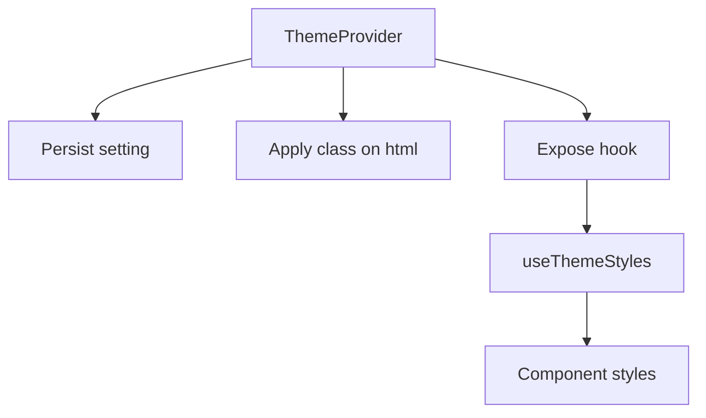

# Theming

## Overview
ThemeProvider controls light/dark/auto and accent color. useThemeStyles centralizes class tokens.

## Flow

## Key Concepts
- Theme mode: light, dark, auto.
- Accent: user-selected color used across UI.
- Centralized styles: useThemeStyles to prevent style drift.

## Related Files
- src/context/ThemeContext.jsx
- src/hooks/useThemeStyles.js
- THEME_REFACTOR_GUIDE.md
